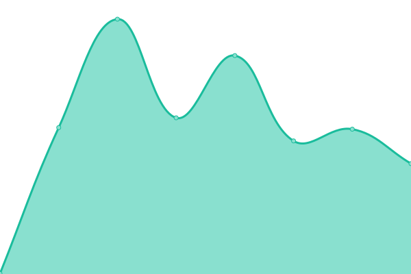
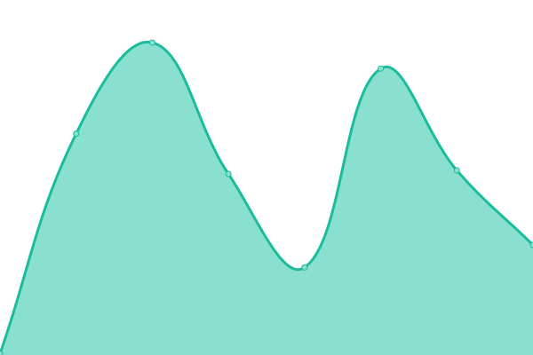

# [📈 Live Status](https://demo.upptime.js.org): <!--live status--> **🟧 Partial outage**

This repository contains the open-source uptime monitor and status page for [Upptime](https://upptime.js.org), powered by [Upptime](https://github.com/upptime/upptime).

With [Upptime](https://upptime.js.org), you can get your own unlimited and free uptime monitor and status page, powered entirely by a GitHub repository. We use [Issues](https://github.com/upptime/upptime/issues) as incident reports, [Actions](https://github.com/theotang/upptime/actions) as uptime monitors, and [Pages](https://demo.upptime.js.org) for the status page.

<!--start: status pages-->
<!-- This summary is generated by Upptime (https://github.com/upptime/upptime) -->
<!-- Do not edit this manually, your changes will be overwritten -->
<!-- prettier-ignore -->
| URL | Status | History | Response Time | Uptime |
| --- | ------ | ------- | ------------- | ------ |
|  [home.6nat.com](https://home.6nat.com) | 🟥 Down | [home-6nat-com.yml](https://github.com/theotang/upptime/commits/HEAD/history/home-6nat-com.yml) | 

 0ms
     
 | 

<a href="https://theotang.github.io/upptime/history/home-6nat-com">0.00%</a>
    

|  [Gorilla Games WI Square site](https://gorillagameswi.square.site) | 🟩 Up | [gorilla-games-wi-square-site.yml](https://github.com/theotang/upptime/commits/HEAD/history/gorilla-games-wi-square-site.yml) | 

 403ms
     
 | 

<a href="https://theotang.github.io/upptime/history/gorilla-games-wi-square-site">100.00%</a>
    

|  [Gorilla Games WI](https://www.gorillagameswi.com/) | 🟩 Up | [gorilla-games-wi.yml](https://github.com/theotang/upptime/commits/HEAD/history/gorilla-games-wi.yml) | 

 302ms
     
 | 

<a href="https://theotang.github.io/upptime/history/gorilla-games-wi">99.95%</a>
    

|  [Badger Meter](https://www.badgermeter.com) | 🟥 Down | [badger-meter.yml](https://github.com/theotang/upptime/commits/HEAD/history/badger-meter.yml) | 

 162ms
     
 | 

<a href="https://theotang.github.io/upptime/history/badger-meter">0.00%</a>
    

|  [IPv6 test](forwardemail.net) | 🟥 Down | [i-pv6-test.yml](https://github.com/theotang/upptime/commits/HEAD/history/i-pv6-test.yml) | 

 0ms
     
 | 

<a href="https://theotang.github.io/upptime/history/i-pv6-test">100.00%</a>
    

<!--end: status pages-->

[**Visit our status website →**](https://demo.upptime.js.org)

## 📄 License

- Powered by: [Upptime](https://github.com/upptime/upptime)
- Code: [MIT](./LICENSE) © [Anand Chowdhary](https://anandchowdhary.com), supported by [Pabio](https://pabio.com)
- Data in the `./history` directory: [Open Database License](https://opendatacommons.org/licenses/odbl/1-0/)
